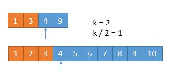

#### 题目
给定两个大小为 m 和 n 的有序数组 nums1 和 nums2。

请你找出这两个有序数组的中位数，并且要求算法的时间复杂度为 O(log(m + n))。

你可以假设 nums1 和 nums2 不会同时为空。

#### 示例
> nums1 = [1, 3]
> nums2 = [2]
> 则中位数是 2.0
 
>nums1 = [1, 2]
>nums2 = [3, 4]
> 则中位数是 (2 + 3)/2 = 2.5

#### 思路
这个题目首先想到的是合并两个数组然后根据合并后的数组计算出中位数，但是这种算法的时间复杂度是 O(n)，空间复杂度也是 O(n)。

代码如下：
```java
public static double findMedianSortedArrays(int[] nums1, int[] nums2) {
             int m = nums1.length;
             int n = nums2.length;
             int length = m + n;
             int firstNumber = (length - 1) / 2;
             int secondNumber = (length - 1) / 2 + 1;
             int[] nums3 = new int[length];

             int i = 0, j = 0, k = 0;
             while (i < m && j < n) {
                   if (nums1[i] < nums2[j]) {
                          nums3[k] = nums1[i];
                          i++;
                   } else {
                          nums3[k] = nums2[j];
                          j++;
                   }
                   k++;
             }

             if (m - 1 >= 0 && i <= m - 1) {
                   for (; i < m; i++) {
                          nums3[k] = nums1[i];
                          k++;
                   }
             }

             if (n - 1 >= 0 && j <= n - 1) {
                   for (; j < n; j++) {
                          nums3[k] = nums2[j];
                          k++;
                   }
             }

             if (length % 2 == 0) {
                   return (nums3[firstNumber] + nums3[secondNumber]) / 2.0d;
             } else {
                   return nums3[firstNumber];
             }

      }

```

但是这种解法不满足题目中时间复杂度  O(log(m + n)) 的要求，没有想到其他更好的方案，看一下 LeetCode 的其他解法。

#### 解法2
LeetCode 上比较经典的是【求第 K 小数法】。因为两个数组都是有序的，寻找第 K 小数的时候我们可以一次拿 k/2 个数据来对比，然后小的那一组数可以排除掉。然后循环直至找到目标数。
例子：
假设要找第 7 小的数：

这里要比较的是两个数组的第 k/2 个数字，如果 k 是奇数，向下取整。上面这个例子中，下面的 3 比较小，这说明 3 及他以前的数都可以排除掉。
排除掉 3 个数字后，现在要做的是在 1349 和 45678910 两个数组中找第 4 小的数。


然后再继续：



现在两个数相等了怎么办？由于两个数相等，我们无论去掉哪个数都行，去掉一个会保留另一个不影响结果。
由于又去掉一个，现在要找的是第一小数，所以只需要判断两个数组中哪个数字较小，这就是我们想要找的数。


##### 特殊情形
如果某一数组的长度小于 k/2，此时将指针指向它的末尾就可以了。

#### 代码
```java
public static double findMedianSortedArrays2(int[] nums1, int[] nums2) {
             int m = nums1.length;
             int n = nums2.length;

             int left = (m + n + 1) / 2;
             int right = (m + n + 2) / 2;
             return (findKthSmallestNumber(nums1, 0, m - 1, nums2, 0, n - 1, 
left)

                          + findKthSmallestNumber(nums1, 0, m - 1, nums2, 0, 
n - 1, right)) / 2.0d;

      }


      public static int findKthSmallestNumber(int[] nums1, int mStart, int 
mEnd, int[] nums2, int nStart, int nEnd,

                   int k) {

             int mLength = mEnd - mStart + 1;

             int nLength = nEnd - nStart + 1;

             //确保 nums1 是数据较少的那个数组

             if (mLength > nLength) {

                   return findKthSmallestNumber(nums2, nStart, nEnd, nums1, 
mStart, mEnd, k);

             }


             if (mLength == 0) {

                   //因为是第 K 小数字，所以返回的时候要将数组下标 -1

                   return nums2[nStart + k - 1];

             }


             if (k == 1) {

                   //第一小了，直接将两个数组中数字较小的那个返回

                   return Math.min(nums1[mStart], nums2[nStart]);

             }


             int i = mStart + Math.min(mLength, k / 2) - 1;

             int j = nStart + Math.min(nLength, k / 2) - 1;


             if (nums1[i] > nums2[j]) {

                   return findKthSmallestNumber(nums1, mStart, mEnd, nums2, 
j + 1, nEnd, k - (j - nStart + 1));

             } else {

                   return findKthSmallestNumber(nums1, i + 1, mEnd, nums2, 
nStart, nEnd, k - (i - mStart + 1));

             }


      }

```

> 写这个算法的时候一定要注意数组下标，第一小数字在数组中的下标是 0。

##### 复杂度
这种写法类似于二分，所以时间复杂度是 O(log(m + n))，没有开辟额外的数组，所以空间复杂度是 O(1)。
